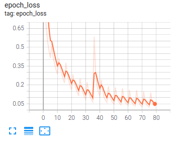

[In English](README.md)
# 二维码检测
基于深度学习的二维码检测

## 介绍
这是一个基于深度学习算法的二维码检测项目，通过一个类似yolov3的目标检测网络，实现了快速，高精度的二维码检测。  
特性：
+ 快速, 在GTX 1060显卡上可以达到大于190的FPS
+ 高精度   
  在验证集上的测试结果 
  |Precision|Recall|Mean IOU|
  |  ----  | ----  |----|
  |0.987|0.819|0.798|
  
+ 多样化部署

## 安装
```shell
git clone https://github.com/cosimo17/QRCodeDetection.git
cd QRCodeDetection
pip install -r requirements.txt
```

## 测试
测试前，请先从 [这里](https://drive.google.com/file/d/1lqlQySkYehgkVJjZtRnYAICla7qSnxeG/view?usp=sharing) 下载预训练好的模型。
```shell
python3 test.py \
	-w yolo_qrcode.h5 \
	-i test_images\1.jpg \
	-o .\result_1.jpg
```

## 训练
* 训练自己的模型之前，请先查看[如何准备训练数据集]()  
* 运行聚类算法，为数据集生成先验的锚点(anchor box)
```shell
python3 utils/kmean.py \
		--root_dir your_dataset_dir \
		-n 6
```

* 使用如下命令启动训练
```shell
python3 train.py \
	-d your_dataset_dir \
	-b 64 \
	-e 80
```
可以运行```python3 train.py --help```来查看参数含义和帮助信息

* 在训练过程中，你可以使用tensorboard来监控loss的收敛曲线
```shell
tensorboard --logdir=./logs
```
  

## 评估
运行如下命令来评估模型的性能:
```shell
python3 evaluate.py \
	-d your_dataset_dir \
	-b 64 \
	--score_threshold 0.5 \
	--iou_threshold 0.5 \
	-w yolo_qrcode.h5
```

## TODO
- [ ] 集成解码模块  
- [ ] 支持docker  
- [ ] 支持openvino  
- [ ] 支持tensorrt  
- [ ] 支持tflite
