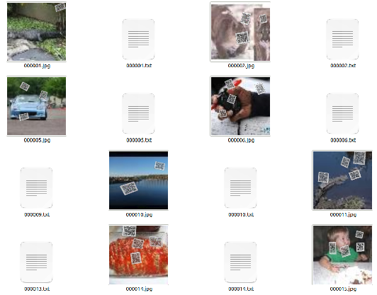

[In English](README.md)
# 如何准备训练数据集

你可以使用生成的虚拟数据集进行训练，也可以使用自己在实际场景中收集标注的数据进行训练。  
建议先使用虚拟数据集进行训练，然后再在自己的数据集上进行微调。

## 生成数据集
这里提供了两个程序来生成虚拟的训练数据。
* 生成二维码图片
```shell
mkdir qrcodes  
# 生成1500张二维码图片，保存在qrcodes目录下
python3 data_generator/generate_qrcode.py \
		-n 1500 \
		-o qrcodes
```
* 准备一些图片作为背景

* 合成二维码
```shell
python3 generate_training_data.py \
		-fg qrcodes \
		-bg your_dir \
		-o training_ds \
		-n 40000 \
		--shape 256
```
生成的数据集如下所示：  


预先使用这两个脚本生成了40000张图片数据和标签，你可以从这里下载到它: [数据集](https://drive.google.com/file/d/1Mv9fC8e4-IJq3MLQ_QA846o4TTjn-9ui/view?usp=sharing)

## 创建自己的数据集
你也可以创建自己的数据集
* 采集图片
* 标注图片  
  你可以使用任何你喜欢的标注工具来标注自己的数据，比如[labelme](https://github.com/wkentaro/labelme) 等
* 确保标注格式符合要求  
  请将标注工具生成的标签转换为如下格式：
  ```
  training_ds
  ------------
  |
  |---000001.jpg
  |---000001.txt 
  |---000002.jpg
  |---000002.txt
  |---...
  |---...
  |---...
  |---xxxxxx.jpg
  |---xxxxxx.txt
  
  每一张图片，都应该有一个同名的txt文件与之对应  
  txt的格式如下  
      cx,cy,w,h,1.0, 1.0
      cx,cyw,h,1.0,1.0
  每一行表示一个二维码对象
  cx,cy表示边界框的中心点坐标，w,h,表示边界框的宽和高，所有的坐标都被归一化到[0-1]之间.
